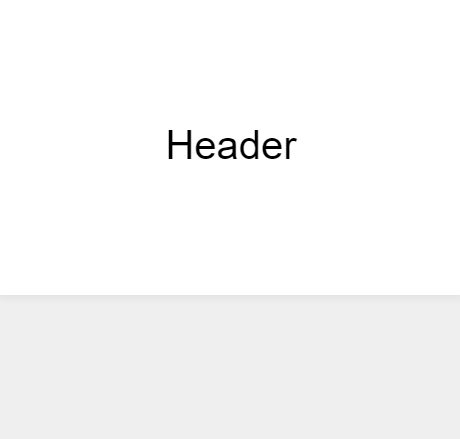

# useHeaderScroll

Control size of elements while scrolling



Working [Demo with useHeaderScroll](https://codesandbox.io/s/use-header-scroll-y15wc)

Working [Demo with useMultiScroll](https://codesandbox.io/s/use-header-scroll-multi-e3m83) <em>*New</em>

## Install

`yarn add use-header-scroll`

or

`npm i --save use-header-scroll`

---

## Using

### Basic - useHeaderScroll
Import

`import useHeaderScroll from "use-header-scroll";`

Call the hook

`const height = useHeaderScroll({ min: 50, max: 120, endOffset: 550 });`

and apply the height on the header

`<header style={{position: 'fixed', height}}>Header</header>`

<br/>


### Advance - useMultiScroll

Import

`import { useMultiScroll } from "use-header-scroll";`

Call the hook

` const [headerHeight, fontSize] = useMultiScroll({
    ranges: [[50, 300], [13, 40]],
    endOffset: 550
  });`

and apply the height on the header

`<header style={{position: 'fixed', height: headerHeight, fontSize}}>Header</header>`

---

## Full Example

```
import React from "react";
import useHeaderScroll from "use-header-scroll";

const Demo = () => {
  const height = useHeaderScroll({ min: 50, max: 120, endOffset: 550 });

  return (
    <div>
      <header
        style={{
          backgroundColor: "red",
          position: "fixed",
          left: 8,
          right: 8,
          top: 0,
          height
        }}
      >
        Header
      </header>
      <article style={{ backgroundColor: "blue", height: 10000 }}>
        Content
      </article>
    </div>
  );
};

export default Demo;

```

## Options

###  useHeaderScroll

`min` - minimum height

`max` - maximum height

`target` - element to listen scroll (default: `window`)

`endOffset` - the scroll offset to fully minimize header

<br/>
###  useMultiScroll

`ranges` - array of arrays `[[min1, max1], [min2, max2]]`


`target` - element to listen scroll (default: `window`)

`endOffset` - the scroll offset to fully minimize header